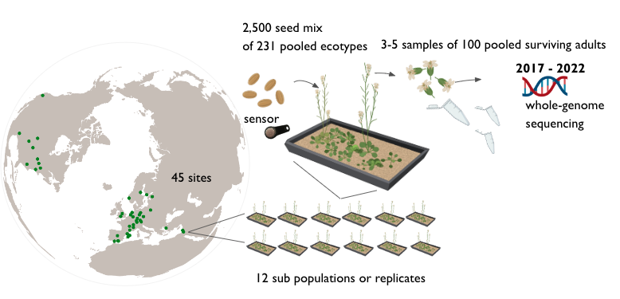

All the sites where Arabidopsis has been growing for the past 4 years!
 

  

Number of flowers collected across the years 

  

   
  

  

   
  

  

Evolution by means of natural selection is the core theme in evolutionary research. Recently, the recognition that rapid evolutionary processes occur widely in nature gave impetus to investigate adaptation of populations to their immediate environmental conditions. Understanding how rapid evolutionary processes occur in nature is of utmost relevance to investigate adaptation to rapid climate change, which has already been documented for many species at the level of phenological and distribution range shifts. Experimental evolution, where evolution is studied in action rather than as the outcome of past processes, is the gold standard in evolutionary research. Such endeavours will yield valuable insight into the process of adaptation.

  

*Allele frequency trajectories in a simulated Wright-Fisher population under drift and with 10 alleles naturally selected*

  
GrENE-net – Genomics of rapid Evolution in Novel Environments – is set up as a coordinated distributed experiment with Arabidopsis thaliana. Its aim is to combine efforts to conduct a large evolution experiment . We invited researchers from across the globe to participate in GrENE-net.
  
Participants received seed mixtures of c. 200 natural accessions of Arabidopsis thaliana which they sowed into small replicated plots. Every year, participants sampled plant material used for genome pool-sequencing throughout their reproductive stage which allowed us to track changes in the abundances of alleles and accessions. Coupled with weather and soil data, we aim to unravel the process of adaptation to these important environmental variables. Our selection experiment will thus increase understanding of how the environment, plant phenotypes and their genetic makeup are linked together and about the evolutionary dynamics behind it. As predicted by local adaptation theory, we expect that success under certain temperature, moisture and soil composition will be related to the environment of origin and phenotypic characteristics of each ecotype.
  

# Gist of the experiment

*Exemplary evolution experiment plot with Arabidopsis thaliana plants*

You can find the general GrENE-net protocol [here](https://docs.google.com/document/d/1HgfTmbjjK6SA6mH916kBzQlJRJXCqWVc6YfpK8VqRXc/edit).

*Photo of the study site in Tubingen, Germany (2017)*

# Policy and ethics statement

Read the full policy and ethics statement [here](https://docs.google.com/document/d/1S_t-mv_uTobVVQD3Jy4xFg89vn-JgrEAXXC1cmC2NBQ/edit).

Note on post-experiment handling of genetic material:

Uncontrolled transplant experiments can lead to genetic contamination of local populations (Rogers & Siemann 2004; Saltonstall K 2002) and to species invasions (Seebens et al. 2017). Although A. thaliana is a cosmopolitan plant native or naturalized to all countries where GrENE-net experiments are carried out, we ask participants to grow their replicate populations in a controlled area, preferably an institution’s ground, free from natural A. thaliana populations. Furthermore, after the experiment all used soil and plant material will be incinerated and a treatment herbicide will be used in a secured perimeter to eliminate any trace of planted seeds, as has been done before in similar outdoor experiments (Exposito-Alonso et al. 2017; Exposito-Alonso et al. 2018).
