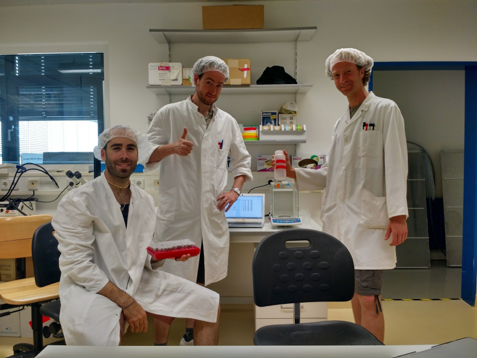

Ever wondered how some million Arabidopsis thaliana seeds look like? (see below)

A Friday of July 2017 we made a big step for the GrENE-net project. We mixed thousands of seeds to generate a common founder population. The seed mixture will then be distributed across the world in controlled experiments to investigate over time how, and whether populations will evolve to climate if all would start with the same genetic diversity.

The mix was generated from seeds of previously grown plants at three different greenhouses and growth chambers (at the Max Planck Institute in Tübingen, the Centre for Functional and Evolutionary Ecology in Montpellier, and the University of Tübingen). These plants were selected from the [1001 Genomes Project](https://1001genomes.org/) collection. A total of 230 genotypes, from a similar number of geographic locations across Europe, North Africa, and Asia.

The GrENE-net coordinators, Moises Exposito-Alonso, François Vasseur, and Niek Scheepens (from left to right), created the master seed mix with extreme care to avoid contamination of the seed mixes with pathogens or with other seeds, and used a high-precision balance in order to record the exact proportion of genotypes in the founder population.
 
After shaking the mix, we aliquoted ~ 1,500 tubes with ~ 5 thousand seeds that were later shipped to 45 locations around the globe. In fall 2017, the seeds were dispersed and the evolution experiment began!