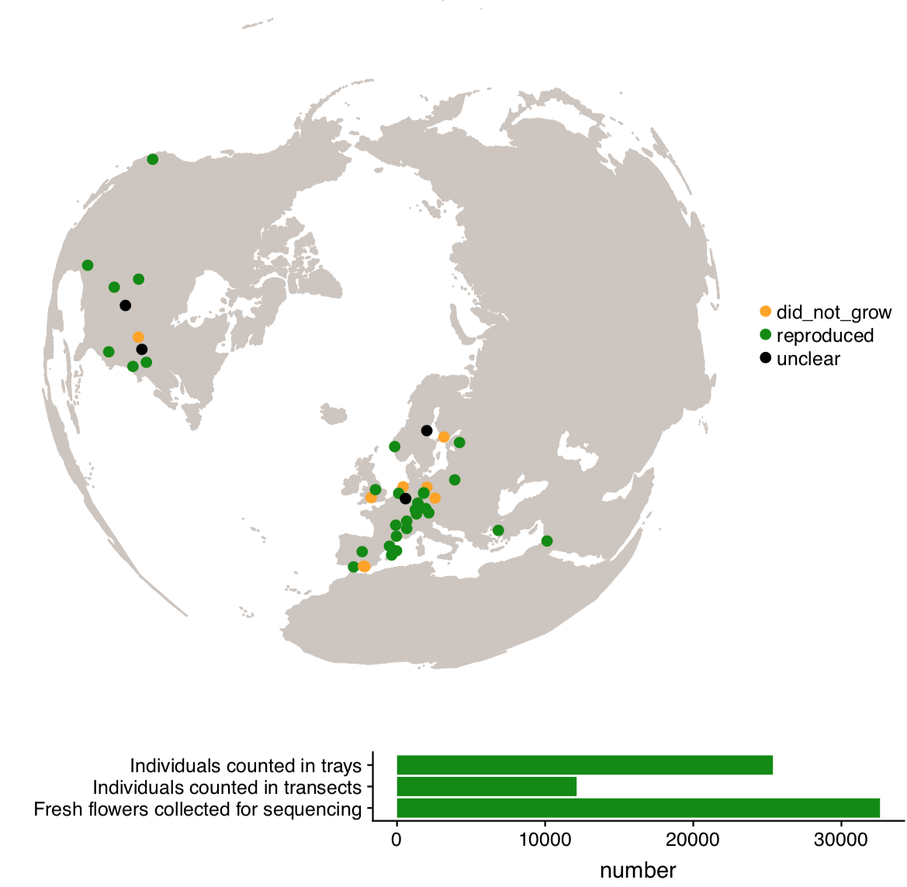
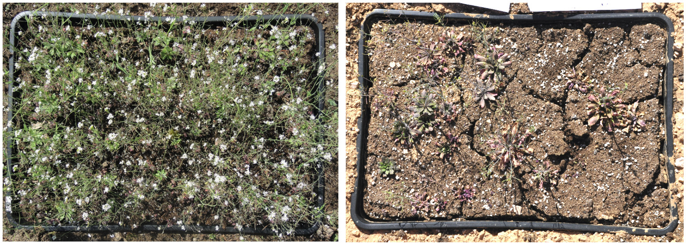

90 enthusiastic researchers and 40 institutions, 45 sites, 12 replicate plots per site, ~5 million seeds distributed and sown. This is how GrENE-net started. A globally distributed experiment to study how the plant species Arabidopsis thaliana may genetically evolve to different climates.

GrENE-net experiments have already grown for 1 generation, and we have exciting news: Arabidopsis is growing in many locations!

Map of sites where Arabidopsis grew and reproduced for the first generation. Total counts of flowers and individual records collected by all GrENE-net participants in 2018.

Arabidopsis growing in the campus of the University of Würzburg, Germany (left) and the Israeli Nagev desert (right). Credit: Arthur Korte and Merav Steifan.

Plants successfully fought the local climate even in some very extreme regions. For example, we did not expect them to grow at all in the Negev desert (Fig. 2). Researchers are currently monitoring the second flowering generation, and the coordinators are getting the sequencing pipeline ready.

Evolution must go on!

